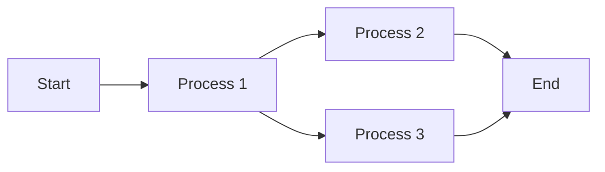
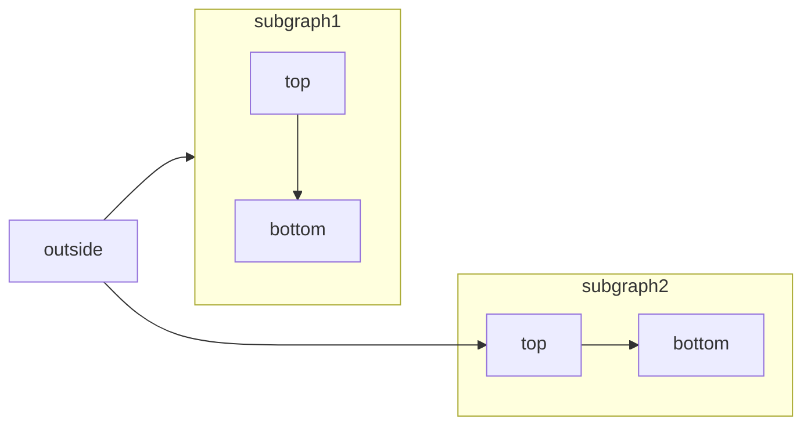
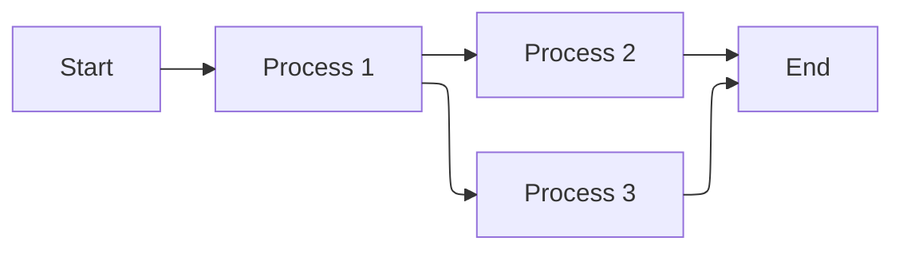

# Mintlify MDX Components — Exhaustive Reference

> Source: [Mintlify Documentation](https://mintlify.com/docs)  
> Compiled: March 21, 2026  
> Coverage: 24 MDX components + 6 content/API feature pages (30 pages total)

---

## Table of Contents

### MDX Components
1. [Accordion / AccordionGroup](#1-accordion--accordiongroup)
2. [Badge](#2-badge)
3. [Banner](#3-banner)
4. [Callouts](#4-callouts)
5. [Card / Columns (CardGroup)](#5-card)
6. [CodeGroup](#6-codegroup)
7. [Color](#7-color)
8. [Columns / Column](#8-columns--column)
9. [Examples (RequestExample / ResponseExample)](#9-examples-requestexample--responseexample)
10. [Expandable](#10-expandable)
11. [Fields (ParamField / ResponseField)](#11-fields-paramfield--responsefield)
12. [Frame](#12-frame)
13. [Icon](#13-icon)
14. [Mermaid Diagrams](#14-mermaid-diagrams)
15. [Panel](#15-panel)
16. [Prompt](#16-prompt)
17. [ResponseField (standalone)](#17-responsefield-standalone)
18. [Steps / Step](#18-steps--step)
19. [Tabs / Tab](#19-tabs--tab)
20. [Tile / Tiles](#20-tile--tiles)
21. [Tooltip](#21-tooltip)
22. [Tree / Tree.Folder / Tree.File](#22-tree--treefolder--treefile)
23. [Update](#23-update)
24. [View](#24-view)

### Content Features
25. [Code Blocks & CodeBlock Component](#25-code-blocks--codeblock-component)
26. [Text Formatting](#26-text-formatting)
27. [Lists and Tables](#27-lists-and-tables)
28. [Images and Embeds](#28-images-and-embeds)
29. [API Playground Overview](#29-api-playground-overview)
30. [OpenAPI Setup](#30-openapi-setup)

---

## Icon System Reference

Many components accept an `icon` prop. The icon source depends on your `docs.json` configuration:

| `icons.library` value | Icon source |
|---|---|
| `fontawesome` | Font Awesome icon name |
| `lucide` | Lucide icon name |
| `tabler` | Tabler icon name |
| _(any)_ | URL to an externally hosted icon |
| _(any)_ | Path to an icon file in your project |
| _(any)_ | SVG code wrapped in curly braces (JSX-compatible) |

**To use inline SVG icons:**
1. Convert your SVG at the [SVGR converter](https://react-svgr.com/playground/)
2. Paste your SVG into the SVG input field
3. Copy the `<svg>...</svg>` element from the JSX output
4. Wrap in curly braces: `icon={<svg ...> ... </svg>}`
5. Adjust `height` and `width` as needed

**`iconType` values (Font Awesome only):**
`regular` | `solid` | `light` | `thin` | `sharp-solid` | `duotone` | `brands`

---

## 1. Accordion / AccordionGroup

**Source:** [mintlify.com/docs/components/accordions](https://mintlify.com/docs/components/accordions)

### Description
Collapsible content sections that support progressive disclosure. Users click the title to expand/collapse content. Can contain any other components including code blocks, callouts, and images.

### MDX Tags
- `<Accordion>` — single collapsible section
- `<AccordionGroup>` — groups multiple accordions into a cohesive section

### Accordion Props

| Prop | Type | Default | Description |
|---|---|---|---|
| `title` | `string` | — | **Required.** Text shown in the collapsed preview header |
| `description` | `string` | — | Subtitle text shown below the title in the preview |
| `defaultOpen` | `boolean` | `false` | Whether the accordion starts open on page load |
| `id` | `string` | Same as `title` | Custom ID for anchor linking (e.g., `#my-id`) |
| `icon` | `string \| SVG` | — | Icon shown next to the title (see Icon System Reference) |
| `iconType` | `string` | `regular` | Font Awesome icon style (see Icon System Reference) |

### AccordionGroup Props
`<AccordionGroup>` has no props of its own — it simply wraps `<Accordion>` children.

### Usage Examples

**Single accordion:**
```mdx
<Accordion title="I am an Accordion.">
  You can put any content in here, including other components, like code:

  ```java HelloWorld.java
  class HelloWorld {
    public static void main(String[] args) {
      System.out.println("Hello, World!");
    }
  }
  ```
</Accordion>
```

**Accordion group with icons:**
```mdx
<AccordionGroup>
  <Accordion title="Getting started">
    You can put other components inside Accordions.
  </Accordion>

  <Accordion title="Advanced features" icon="alien-8bit">
    Add icons to make accordions more visually distinct and scannable.
  </Accordion>

  <Accordion title="Troubleshooting">
    Keep related content organized into groups.
  </Accordion>
</AccordionGroup>
```

### Visual Behavior
- Collapsed state shows `title` and optional `description`
- Clicking expands to reveal full content with smooth animation
- `AccordionGroup` visually connects related accordions (shared borders)
- When `defaultOpen={true}`, accordion renders expanded on page load
- Supports any nested content including code blocks, images, other components

---

## 2. Badge

**Source:** [mintlify.com/docs/components/badge](https://mintlify.com/docs/components/badge)

### Description
Inline label elements for highlighting status, labels, metadata, or categories. Works both standalone and inline within text paragraphs.

### MDX Tag
`<Badge>`

### Props

| Prop | Type | Default | Description |
|---|---|---|---|
| `color` | `string` | — | Color variant (see options below) |
| `size` | `string` | `md` | Size variant: `xs` \| `sm` \| `md` \| `lg` |
| `shape` | `string` | `rounded` | Shape: `rounded` \| `pill` |
| `icon` | `string \| SVG` | — | Icon displayed inside the badge |
| `iconType` | `string` | `regular` | Font Awesome icon style |
| `stroke` | `boolean` | `false` | Use outline/stroke variant instead of filled background |
| `disabled` | `boolean` | `false` | Reduced opacity disabled state |
| `className` | `string` | — | Additional CSS classes |

**Color options:**
`gray` | `blue` | `green` | `yellow` | `orange` | `red` | `purple` | `white` | `surface` | `white-destructive` | `surface-destructive`

### Usage Examples

**Basic badge:**
```mdx
<Badge>Badge</Badge>
```

**Colored badges:**
```mdx
<Badge color="gray">Badge</Badge>
<Badge color="blue">Badge</Badge>
<Badge color="green">Badge</Badge>
<Badge color="yellow">Badge</Badge>
<Badge color="orange">Badge</Badge>
<Badge color="red">Badge</Badge>
<Badge color="purple">Badge</Badge>
<Badge color="white">Badge</Badge>
<Badge color="surface">Badge</Badge>
<Badge color="white-destructive">Badge</Badge>
<Badge color="surface-destructive">Badge</Badge>
```

**Sizes:**
```mdx
<Badge size="xs">Badge</Badge>
<Badge size="sm">Badge</Badge>
<Badge size="md">Badge</Badge>
<Badge size="lg">Badge</Badge>
```

**Shapes:**
```mdx
<Badge shape="rounded">Badge</Badge>
<Badge shape="pill">Badge</Badge>
```

**With icons:**
```mdx
<Badge icon="circle-check" color="green">Badge</Badge>
<Badge icon="clock" color="orange">Badge</Badge>
<Badge icon="ban" color="red">Badge</Badge>
```

**Stroke (outline) variant:**
```mdx
<Badge stroke color="blue">Badge</Badge>
<Badge stroke color="green">Badge</Badge>
<Badge stroke color="orange">Badge</Badge>
<Badge stroke color="red">Badge</Badge>
```

**Disabled state:**
```mdx
<Badge disabled icon="lock" color="gray">Badge</Badge>
<Badge disabled icon="lock" color="blue">Badge</Badge>
```

**Inline within text:**
```mdx
This feature requires a <Badge color="orange" size="sm">Premium</Badge> subscription.
```

**Combined properties:**
```mdx
<Badge icon="star" color="blue" size="lg" shape="pill">Premium</Badge>
<Badge icon="check" stroke color="green" size="sm">Verified</Badge>
<Badge icon="badge-alert" color="orange" shape="rounded">Beta</Badge>
```

### Visual Behavior
- Renders as an inline element; fits naturally within paragraph text
- Filled background by default; `stroke` switches to border-only style
- `disabled` reduces opacity to indicate inactive state
- `pill` shape produces fully rounded ends; `rounded` has moderate corner radius

---

## 3. Banner

**Source:** [mintlify.com/docs/components/banner](https://mintlify.com/docs/components/banner)

### Description
A site-wide announcement bar displayed at the top of all pages. Configured in `docs.json` (not an inline MDX component). Supports dismissal, Markdown formatting, and per-language variants.

### Configuration Location
`docs.json` — `banner` property (global) or `navigation.languages[].banner` (per-language)

> **Note:** Banner is NOT an inline MDX component. It is a site-wide configuration option in `docs.json`.

### Props

| Prop | Type | Default | Description |
|---|---|---|---|
| `content` | `string` | — | **Required.** Text shown in the banner. Supports Markdown: links, bold, italic. Custom MDX components are NOT supported. |
| `dismissible` | `boolean` | `false` | Shows a close button. Once dismissed, stays hidden until `content` is updated. |

### Usage Examples

**Global banner (docs.json):**
```json
"banner": {
  "content": "🚀 Version 2.0 is now live! See our [changelog](/changelog) for details.",
  "dismissible": true
}
```

**Language-specific banners (docs.json):**
```json
"navigation": {
  "languages": [
    {
      "language": "en",
      "banner": {
        "content": "🚀 Version 2.0 is now live! See our [changelog](/en/changelog) for details.",
        "dismissible": true
      },
      "groups": [
        {
          "group": "Getting started",
          "pages": ["en/overview", "en/quickstart"]
        }
      ]
    },
    {
      "language": "es",
      "banner": {
        "content": "🚀 ¡La versión 2.0 ya está disponible! Consulta nuestro [registro de cambios](/es/changelog) para más detalles.",
        "dismissible": true
      },
      "groups": [
        {
          "group": "Getting started",
          "pages": ["es/overview", "es/quickstart"]
        }
      ]
    }
  ]
},
"banner": {
  "content": "🚀 Version 2.0 is now live!",
  "dismissible": true
}
```

### Fallback Priority
1. **Language-specific banner** — if the current language has a `banner`, it takes priority
2. **Global banner** — displayed if no language-specific banner is configured

### Visual Behavior
- Appears as a full-width bar above the navigation header
- Supports inline Markdown formatting (links, bold, italic) but not MDX components
- Dismissal persists per-user until `content` value changes
- Styled with the documentation's primary color theme

---

## 4. Callouts

**Source:** [mintlify.com/docs/components/callouts](https://mintlify.com/docs/components/callouts)

### Description
Styled alert boxes to highlight important information. Includes six preset typed variants and a fully customizable generic `<Callout>` component.

### MDX Tags

**Preset typed variants** (accept only `children`, no additional props):
- `<Note>` — informational note (blue)
- `<Warning>` — warning (yellow/orange)
- `<Info>` — general information (blue)
- `<Tip>` — helpful tip (green)
- `<Check>` — success/confirmation (green)
- `<Danger>` — critical danger/error (red)

**Custom variant:**
- `<Callout>` — fully customizable with `icon` and `color`

### Callout Props (custom `<Callout>` only)

| Prop | Type | Default | Description |
|---|---|---|---|
| `icon` | `string \| SVG` | — | Icon to display (see Icon System Reference) |
| `iconType` | `string` | `regular` | Font Awesome icon style |
| `color` | `string` | — | Custom hex color for border, background tint, and text (e.g., `#FFC107`) |
| `children` | `ReactNode` | — | Content of the callout (Markdown supported) |

### Usage Examples

**Preset typed callouts:**
```mdx
<Note>This adds a note in the content</Note>

<Warning>This raises a warning to watch out for</Warning>

<Info>This draws attention to important information</Info>

<Tip>This suggests a helpful tip</Tip>

<Check>This brings us a checked status</Check>

<Danger>This is a danger callout</Danger>
```

**Custom callout:**
```mdx
<Callout icon="key" color="#FFC107" iconType="regular">
  This is a custom callout
</Callout>
```

### Visual Behavior
- Rendered as a bordered, tinted box with an icon on the left
- Each preset type has a distinct color and icon:
  - `<Note>` — pencil/note icon, blue
  - `<Warning>` — warning triangle, yellow
  - `<Info>` — info circle, blue
  - `<Tip>` — lightbulb, green
  - `<Check>` — checkmark, green
  - `<Danger>` — stop/error, red
- Custom `<Callout>` uses `color` to set border, background tint, and text color uniformly
- All variants support full Markdown and nested MDX components in `children`

---

## 5. Card

**Source:** [mintlify.com/docs/components/cards](https://mintlify.com/docs/components/cards)

### Description
Highlighted content blocks with optional icon, image, title, and link. Used for navigation, feature highlights, and quick-reference links. Group cards using `<Columns>`.

### MDX Tag
`<Card>`

### Props

| Prop | Type | Default | Description |
|---|---|---|---|
| `title` | `string` | — | **Required.** Title text displayed on the card |
| `icon` | `string \| SVG` | — | Icon displayed next to or above the title |
| `iconType` | `string` | `regular` | Font Awesome icon style |
| `color` | `string` | — | Icon color as a hex code (e.g., `#FF6B6B`) |
| `href` | `string` | — | URL to navigate to when the card is clicked |
| `horizontal` | `boolean` | `false` | Compact horizontal layout (icon and title side by side) |
| `img` | `string` | — | URL or local path to an image displayed at the top of the card |
| `cta` | `string` | — | Custom text for the call-to-action button |
| `arrow` | `boolean \| string` | — | Show/hide the link arrow icon. By default, arrows only appear for external links. |

### Usage Examples

**Basic card with icon and link:**
```mdx
<Card title="Card title" icon="text-align-start" href="/components/columns">
  This is how you use a card with an icon and a link. Clicking on this card
  brings you to the Columns page.
</Card>
```

**Horizontal layout:**
```mdx
<Card title="Horizontal card" icon="text-align-start" horizontal>
  This is an example of a horizontal card.
</Card>
```

**Card with image:**
```mdx
<Card title="Image card" img="/images/card-with-image.png">
  This is an example of a card with an image.
</Card>
```

**Card with custom CTA and arrow:**
```mdx
<Card
  title="Link card"
  icon="link"
  href="/components/columns"
  arrow="true"
  cta="Click here"
>
  This is an example of a card with an icon and a link.
</Card>
```

**Multiple cards in a grid (using Columns):**
```mdx
<Columns cols={2}>
  <Card title="First card" icon="panel-left-close">
    This is the first card.
  </Card>
  <Card title="Second card" icon="panel-right-close">
    This is the second card.
  </Card>
</Columns>
```

### Visual Behavior
- Renders as a bordered box with optional icon, title, description text, and bottom CTA
- `horizontal` collapses icon+title into a single row for compact display
- `img` shows an image banner at the top of the card
- When `href` is set, the entire card is clickable
- `arrow` defaults to visible for external links only; can be forced on/off

---

## 6. CodeGroup

**Source:** [mintlify.com/docs/components/code-groups](https://mintlify.com/docs/components/code-groups)

### Description
A tabbed interface for displaying multiple code blocks together, allowing users to compare implementations across different languages or approaches.

### MDX Tag
`<CodeGroup>`

### Props

| Prop | Type | Default | Description |
|---|---|---|---|
| `dropdown` | `boolean` | `false` | Replace tabs with a dropdown menu for language selection |

### Tab Synchronization
Code groups automatically synchronize with other `<CodeGroup>` and `<Tabs>` components on the same page when their **labels/titles match**. Selecting a language in one group updates all matching groups simultaneously.

### Usage Examples

**Basic code group (tabbed):**
```mdx
<CodeGroup>

```javascript helloWorld.js
console.log("Hello World");
```

```python hello_world.py
print('Hello World!')
```

```java HelloWorld.java
class HelloWorld {
  public static void main(String[] args) {
    System.out.println("Hello, World!");
  }
}
```

</CodeGroup>
```

**With dropdown instead of tabs:**
```mdx
<CodeGroup dropdown>

```javascript helloWorld.js
console.log("Hello World");
```

```python hello_world.py
print('Hello World!')
```

</CodeGroup>
```

### Visual Behavior
- Default: renders as a horizontal tab bar above the code block
- `dropdown`: replaces tabs with a single dropdown selector
- Inherits global code block styling from `docs.json` `styling.codeblocks`
- Tabs synchronize across the page when labels match (same behavior as `<Tabs>`)
- Each code block inside must have a title (used as the tab label)

---

## 7. Color

**Source:** [mintlify.com/docs/components/color](https://mintlify.com/docs/components/color)

### Description
Display color palettes with click-to-copy functionality. Supports multiple display variants, CSS color formats, and theme-aware light/dark mode colors.

### MDX Tags
- `<Color>` — wrapper for the palette
- `<Color.Row>` — labeled row (for `table` variant)
- `<Color.Item>` — individual color swatch

### Color Props

| Prop | Type | Default | Description |
|---|---|---|---|
| `variant` | `string` | — | Display style: `compact` \| `table` |
| `children` | `ReactNode` | — | `Color.Item` or `Color.Row` elements |

### Color.Row Props

| Prop | Type | Default | Description |
|---|---|---|---|
| `title` | `string` | — | **Required.** Label for the row |
| `children` | `ReactNode` | — | `Color.Item` elements |

### Color.Item Props

| Prop | Type | Default | Description |
|---|---|---|---|
| `name` | `string` | — | **Required.** Display name/label for the color |
| `value` | `string \| object` | — | **Required.** Color value in any CSS format, OR `{ light: "...", dark: "..." }` for theme-aware |

**Supported CSS color formats:** `hex` (`#FF5733`), `rgb(...)`, `rgba(...)`, `hsl(...)`, `oklch(...)`

### Usage Examples

**Compact variant:**
```mdx
<Color variant="compact">
  <Color.Item name="blue-500" value="#3B82F6" />
  <Color.Item name="blue-600" value="#2563EB" />
  <Color.Item name="blue-700" value="#1D4ED8" />
  <Color.Item name="blue-800" value="#1E40AF" />
</Color>
```

**Table variant with rows:**
```mdx
<Color variant="table">
  <Color.Row title="Primary">
    <Color.Item name="primary-500" value="#3B82F6" />
    <Color.Item name="primary-600" value="#2563EB" />
    <Color.Item name="primary-700" value="#1D4ED8" />
  </Color.Row>
  <Color.Row title="Secondary">
    <Color.Item name="secondary-500" value="#8B5CF6" />
    <Color.Item name="secondary-600" value="#7C3AED" />
  </Color.Row>
</Color>
```

**Multiple CSS formats:**
```mdx
<Color variant="compact">
  <Color.Item name="hex" value="#FF5733" />
  <Color.Item name="rgb" value="rgb(51, 255, 87)" />
  <Color.Item name="rgba" value="rgba(51, 87, 255, 0.7)" />
  <Color.Item name="hsl" value="hsl(180, 70%, 55%)" />
  <Color.Item name="oklch" value="oklch(70% 0.2 145)" />
</Color>
```

**Theme-aware (light/dark mode):**
```mdx
<Color variant="compact">
  <Color.Item name="bg-primary" value={{ light: "#FFFFFF", dark: "#000000" }} />
  <Color.Item name="bg-secondary" value={{ light: "#F9FAFB", dark: "#0A0A0A" }} />
  <Color.Item name="text-primary" value={{ light: "#111827", dark: "#F9FAFB" }} />
</Color>
```

### Visual Behavior
- Each `Color.Item` renders as a color swatch with the name and value
- Clicking a swatch copies the color value to clipboard
- `compact`: simple grid of swatches with name and hex value below
- `table`: swatches organized in labeled rows for design system documentation
- Theme-aware values show different swatches in light vs. dark mode

---

## 8. Columns / Column

**Source:** [mintlify.com/docs/components/columns](https://mintlify.com/docs/components/columns)

### Description
Responsive grid layout for arranging `<Card>` components or arbitrary content side by side. Automatically adjusts for smaller screens. Supports 1–4 columns.

### MDX Tags
- `<Columns>` — grid wrapper
- `<Column>` — wraps arbitrary content in a single grid cell

### Columns Props

| Prop | Type | Default | Description |
|---|---|---|---|
| `cols` | `number` | — | **Required.** Number of columns per row. Accepts `1` to `4`. |
| `children` | `ReactNode` | — | `Card`, `Column`, or any other components |

### Column Props
`<Column>` has no props — it wraps any content as a grid cell.

### Usage Examples

**Two-column card grid:**
```mdx
<Columns cols={2}>
  <Card title="Get started">
    Set up your project with our quickstart guide.
  </Card>
  <Card title="API reference">
    Explore endpoints, parameters, and examples for your API.
  </Card>
</Columns>
```

**Arbitrary content side by side with Column:**
```mdx
<Columns cols={2}>
  <Column>

    **Installation**

    ```bash
    npm install my-package
    ```

  </Column>
  <Column>

    **Usage**

    ```javascript
    import { init } from 'my-package';
    init();
    ```

  </Column>
</Columns>
```

**Three-column layout:**
```mdx
<Columns cols={3}>
  <Card title="First card" icon="panel-left-close">
    This is the first card.
  </Card>
  <Card title="Second card" icon="panel-right-close">
    This is the second card.
  </Card>
  <Card title="Third card" icon="panel-top-close">
    This is the third card.
  </Card>
</Columns>
```

### Visual Behavior
- Creates a CSS grid with the specified number of equal-width columns
- Responsive: automatically reduces column count on smaller screens
- `<Column>` enables placing any arbitrary content (text, code, images) in a grid cell

---

## 9. Examples (RequestExample / ResponseExample)

**Source:** [mintlify.com/docs/components/examples](https://mintlify.com/docs/components/examples)

### Description
Pin code blocks to the right sidebar to create a two-column layout. Keeps examples visible while users scroll through content. Especially useful for API documentation.

### MDX Tags
- `<RequestExample>` — pins code to the right sidebar (use for request examples)
- `<ResponseExample>` — pins code to the right sidebar below any `<RequestExample>`

> On mobile, both components render as regular inline code blocks.

### Props (both components share the same props)

| Prop | Type | Default | Description |
|---|---|---|---|
| `dropdown` | `boolean` | `false` | Display a language dropdown instead of tabs for multiple code blocks |
| `children` | `ReactNode` | — | One or more code blocks (each must have a `title` attribute) |

### Usage Examples

**Request example:**
```mdx
<RequestExample>

```bash Request
curl --request POST \
  --url https://dog-api.kinduff.com/api/facts
```

</RequestExample>
```

**Response example:**
```mdx
<ResponseExample>

```json Response
{ "status": "success" }
```

</ResponseExample>
```

**Combined request + response:**
```mdx
<RequestExample>

```bash cURL
curl --request GET \
  --url https://api.example.com/users \
  --header 'Authorization: Bearer TOKEN'
```

```python Python
import requests
response = requests.get(
    "https://api.example.com/users",
    headers={"Authorization": "Bearer TOKEN"}
)
```

</RequestExample>

<ResponseExample>

```json 200 OK
{
  "users": [
    { "id": 1, "name": "Alice" },
    { "id": 2, "name": "Bob" }
  ]
}
```

</ResponseExample>
```

### Visual Behavior
- On desktop: code blocks float to the right sidebar column, remaining sticky as users scroll
- `<ResponseExample>` appears below `<RequestExample>` in the sidebar
- If a `<Panel>` component is present, `RequestExample` and `ResponseExample` must be placed inside `<Panel>`
- Multiple code blocks become tabs (or a dropdown with `dropdown` prop) just like `<CodeGroup>`

---

## 10. Expandable

**Source:** [mintlify.com/docs/components/expandables](https://mintlify.com/docs/components/expandables)

### Description
A toggle component that shows/hides nested object properties. Primarily used inside `<ResponseField>` to document nested API objects without overwhelming the reader.

### MDX Tag
`<Expandable>`

### Props

| Prop | Type | Default | Description |
|---|---|---|---|
| `title` | `string` | — | Label displayed on the expandable toggle (e.g., `"properties"`) |
| `defaultOpen` | `boolean` | `false` | Open the expandable section on page load |
| `children` | `ReactNode` | — | Nested `<ResponseField>` or other content |

### Usage Example

```mdx
<ResponseField name="user" type="User Object">
  <Expandable title="properties">
    <ResponseField name="full_name" type="string">
      The full name of the user
    </ResponseField>

    <ResponseField name="is_over_21" type="boolean">
      Whether the user is over 21 years old
    </ResponseField>
  </Expandable>
</ResponseField>
```

### Visual Behavior
- Renders as a clickable "properties" row with an expand/collapse chevron
- Nested fields are hidden by default (unless `defaultOpen={true}`)
- Supports any depth of nesting by placing `<Expandable>` inside `<Expandable>`
- Typically used to document nested object shapes in API response documentation

---

## 11. Fields (ParamField / ResponseField)

**Source:** [mintlify.com/docs/components/fields](https://mintlify.com/docs/components/fields)

### Description
Structured documentation components for API parameters and response values with type information, required/optional indicators, and deprecation status.

### MDX Tags
- `<ParamField>` — documents API request parameters (automatically adds API Playground)
- `<ResponseField>` — documents API response values

---

### ParamField

#### MDX Syntax
`<ParamField {location} {name} type="{type}" [required] [deprecated]>`

The first attribute specifies the parameter location AND name. Format: `{path|query|body|header}="paramName"`

#### ParamField Props

| Prop | Type | Default | Description |
|---|---|---|---|
| `path` / `query` / `body` / `header` | `string` | — | **Required.** Parameter location (attribute name) and parameter name (attribute value). E.g., `path="userId"` |
| `type` | `string` | — | Expected value type: `number`, `string`, `boolean`, `object`, or arrays with `[]` suffix (e.g., `string[]`) |
| `required` | `boolean` | `false` | Mark the parameter as required |
| `deprecated` | `boolean` | `false` | Mark the parameter as deprecated |
| `default` | `any` | — | Default value pre-populated when the request value is empty |
| `placeholder` | `string` | — | Placeholder text for the input in the playground |
| `children` | `ReactNode` | — | Description (Markdown-enabled) |

#### ParamField Usage Examples

```mdx
<ParamField path="param" type="string" required>
  An example of a parameter field
</ParamField>

<ParamField query="limit" type="number" default="20" placeholder="e.g. 50">
  Maximum number of records to return
</ParamField>

<ParamField body="tags" type="string[]">
  Array of tag strings to apply to the resource
</ParamField>

<ParamField header="Authorization" type="string" required>
  Bearer token for authentication. Format: `Bearer <token>`
</ParamField>

<ParamField path="legacyId" type="string" deprecated>
  **Deprecated.** Use `userId` instead.
</ParamField>
```

---

### ResponseField

#### ResponseField Props

| Prop | Type | Default | Description |
|---|---|---|---|
| `name` | `string` | — | **Required.** Name of the response field |
| `type` | `string` | — | Expected type (any arbitrary string, not restricted to built-in types) |
| `default` | `any` | — | Default value |
| `required` | `boolean` | `false` | Show "required" indicator beside the field name |
| `deprecated` | `boolean` | `false` | Mark field as deprecated |
| `prepend` | `ReactNode` | — | Labels shown before the field name |
| `append` | `ReactNode` | — | Labels shown after the field name |
| `children` | `ReactNode` | — | Field description |

#### ResponseField Usage Examples

```mdx
<ResponseField name="response" type="string" required>
  A response field example
</ResponseField>

<ResponseField name="user" type="User Object">
  <Expandable title="properties">
    <ResponseField name="full_name" type="string">
      The full name of the user
    </ResponseField>
    <ResponseField name="is_over_21" type="boolean">
      Whether the user is over 21 years old
    </ResponseField>
  </Expandable>
</ResponseField>
```

### Visual Behavior
- Renders as a structured row with: name, type badge, required/optional indicator, description
- `<ParamField>` placement on a page automatically triggers the API Playground
- `<Expandable>` nested inside `<ResponseField>` creates collapsible nested object documentation

---

## 12. Frame

**Source:** [mintlify.com/docs/components/frames](https://mintlify.com/docs/components/frames)

### Description
A wrapper container that visually frames images or other components with a border and optional caption. Useful for centering images, adding consistent styling, or adding descriptive context.

### MDX Tag
`<Frame>`

### Props

| Prop | Type | Default | Description |
|---|---|---|---|
| `caption` | `string` | — | Optional caption text displayed centered below the content |
| `children` | `ReactNode` | — | Image or component to display inside the frame |

### Usage Examples

**Basic image frame:**
```mdx
<Frame>
  
</Frame>
```

**Frame with caption:**
```mdx
<Frame caption="Yosemite National Park is visited by over 3.5 million people every year">
  
</Frame>
```

**Frame with an img tag using JSX styles:**
```mdx
<Frame caption="Dashboard overview">
  
</Frame>
```

### Visual Behavior
- Adds a styled border and padding around the content
- Centers the inner content
- Caption appears as smaller centered text below the frame
- Commonly used to give images a polished, consistent appearance in documentation

---

## 13. Icon

**Source:** [mintlify.com/docs/components/icons](https://mintlify.com/docs/components/icons)

### Description
Renders a standalone icon from the configured icon library, an external URL, or a file path. Can be used inline within text or as a standalone element.

### MDX Tag
`<Icon>`

### Props

| Prop | Type | Default | Description |
|---|---|---|---|
| `icon` | `string` | — | **Required.** Icon name, URL, or file path (see Icon System Reference) |
| `iconType` | `string` | `regular` | Font Awesome icon style |
| `color` | `string` | — | Icon color as a hex code (e.g., `#FF5733`) |
| `size` | `number` | — | Icon size in pixels |
| `className` | `string` | — | Custom CSS class name |

### Usage Examples

**Standalone icon:**
```mdx
<Icon icon="flag" size={32} />
```

**Inline within text:**
```mdx
Icons are placed inline when used within a sentence, paragraph, or heading. <Icon icon="flag" iconType="solid" /> Use icons for decoration or to add visual emphasis.
```

**Colored icon:**
```mdx
<Icon icon="star" color="#FFD700" size={24} />
```

### Visual Behavior
- When placed within a paragraph, renders inline with the text (baseline-aligned)
- `size` defaults to the current text size when used inline
- `color` overrides the default inherited color
- Icon library is determined by `icons.library` in `docs.json`

---

## 14. Mermaid Diagrams

**Source:** [mintlify.com/docs/components/mermaid-diagrams](https://mintlify.com/docs/components/mermaid-diagrams)

### Description
Create flowcharts, sequence diagrams, Gantt charts, class diagrams, and other visualizations using Mermaid syntax within fenced code blocks. Supports interactive zoom/pan controls and the ELK layout engine.

### MDX Syntax
Mermaid diagrams are written as fenced code blocks with the language set to `mermaid`:

````
```mermaid [options]
// diagram definition
```
````

### Code Block Meta Options

| Option | Type | Default | Description |
|---|---|---|---|
| `actions` | `boolean` | Auto (shown when height > 120px) | Show or hide interactive zoom/pan controls |
| `placement` | `string` | — | Position of interactive controls: `top-left` \| `top-right` \| `bottom-left` \| `bottom-right` |

### Usage Examples

**Basic flowchart:**
````mdx

````

**With nested subgraphs:**
````mdx

````

**With ELK layout engine:**
````mdx

````

**Hide interactive controls:**
````mdx

````

**Show controls in top-left corner:**
````mdx

````

### Interactive Controls
All diagrams (when visible) include:
- **Zoom in/out**: Increase or decrease diagram scale
- **Pan**: Directional arrows to navigate
- **Reset view**: Return to original view
- Controls are shown by default when diagram height exceeds 120px

### Keyboard Navigation
Available when a diagram is focused — uses standard browser-level interactions.

### Visual Behavior
- Renders as a full-width SVG diagram
- ELK layout optimizes arrangement to reduce overlapping edges in complex graphs
- Controls overlay the diagram in the configured `placement` corner

---

## 15. Panel

**Source:** [mintlify.com/docs/components/panel](https://mintlify.com/docs/components/panel)

### Description
Customizes the right-side panel of a page. When `<Panel>` is used, it replaces the default table of contents. Any `<RequestExample>` or `<ResponseExample>` on the same page must be placed inside `<Panel>`.

### MDX Tag
`<Panel>`

### Props

| Prop | Type | Default | Description |
|---|---|---|---|
| `children` | `ReactNode` | — | Any components to display in the right panel |

> **Important constraints:**
> - `<Panel>` replaces the page's table of contents
> - If a page has `<Panel>`, all `<RequestExample>` and `<ResponseExample>` components must be inside `<Panel>`

### Usage Example

```mdx
<Panel>
  <Info>Pin info to the side panel. Or add any other component.</Info>
</Panel>
```

**With request/response examples:**
```mdx
<Panel>
  <RequestExample>

  ```bash cURL
  curl --request GET \
    --url https://api.example.com/users
  ```

  </RequestExample>

  <ResponseExample>

  ```json 200 OK
  { "users": [] }
  ```

  </ResponseExample>
</Panel>
```

### Visual Behavior
- Content appears in the right sidebar panel (where the table of contents normally lives)
- Table of contents is removed when `<Panel>` is present
- Useful for always-visible contextual information alongside page content

---

## 16. Prompt

**Source:** [mintlify.com/docs/components/prompt](https://mintlify.com/docs/components/prompt)

### Description
Displays pre-built AI prompt templates with copy and Cursor IDE integration actions. Designed for AI/LLM documentation pages where users need ready-to-use prompts.

### MDX Tag
`<Prompt>`

### Props

| Prop | Type | Default | Description |
|---|---|---|---|
| `description` | `string` | — | Text displayed in the prompt card header. Supports Markdown formatting. |
| `actions` | `string[]` | — | Array of available actions: `"copy"` (copy to clipboard) and/or `"cursor"` (open in Cursor IDE) |
| `icon` | `string \| SVG` | — | Icon displayed in the prompt card |
| `iconType` | `string` | `regular` | Font Awesome icon style |
| `children` | `ReactNode` | — | The prompt text content (copied to clipboard or opened in Cursor) |

### Usage Examples

**Basic prompt:**
```mdx
<Prompt description="Generate clear, concise documentation.">
You are a **technical writing assistant**. Write documentation that is clear, accurate, and concise.
- Use second-person voice ("you") and active verbs.
- Start procedures with a goal-oriented heading.
- Before writing, ask clarifying questions about the end users of the documentation, their goals, and their needs.
</Prompt>
```

**With multiple properties:**
```mdx
<Prompt
  description="Generate **clear**, *concise* documentation."
  icon="paperclip"
  iconType="solid"
  actions={["copy", "cursor"]}
>
You are a **technical writing assistant**. Write documentation that is clear, accurate, and concise.
- Use second-person voice ("you") and active verbs.
- Start procedures with a goal-oriented heading.
- Before writing, ask clarifying questions about the end users of the documentation, their goals, and their needs.
</Prompt>
```

### Visual Behavior
- Renders as a styled card with the `description` as a header
- Action buttons appear (copy icon, Cursor icon) based on `actions` array
- Clicking "copy" copies the full `children` text to clipboard
- Clicking "cursor" opens the prompt in Cursor IDE
- `description` supports Markdown formatting (bold, italic, etc.)

---

## 17. ResponseField (standalone)

**Source:** [mintlify.com/docs/components/responses](https://mintlify.com/docs/components/responses)

> This is the same `<ResponseField>` component documented in [Fields](#11-fields-paramfield--responsefield). See that section for the full reference.

### Quick Reference

```mdx
<ResponseField name="response" type="string" required>
  A response field example
</ResponseField>
```

**Props:** `name` (string, required), `type` (string), `default` (any), `required` (boolean), `deprecated` (boolean), `prepend` (ReactNode), `append` (ReactNode)

---

## 18. Steps / Step

**Source:** [mintlify.com/docs/components/steps](https://mintlify.com/docs/components/steps)

### Description
Numbered sequential procedure documentation with visual step indicators. Ideal for tutorials, onboarding flows, and setup guides.

### MDX Tags
- `<Steps>` — wrapper that numbers and connects individual steps
- `<Step>` — individual step with title and content

### Steps Props

| Prop | Type | Default | Description |
|---|---|---|---|
| `titleSize` | `string` | `h3` | Title heading size: `p` \| `h2` \| `h3` \| `h4` |
| `children` | `ReactNode` | — | One or more `<Step>` components |

### Step Props

| Prop | Type | Default | Description |
|---|---|---|---|
| `title` | `string` | — | **Required.** Primary text for the step, shown next to the step indicator |
| `icon` | `string \| SVG` | — | Custom icon replacing the default number indicator |
| `iconType` | `string` | `regular` | Font Awesome icon style |
| `stepNumber` | `number` | Auto | Manual override for the step number displayed |
| `titleSize` | `string` | Inherits from `<Steps>` | Override title heading size for this specific step |
| `id` | `string` | Auto from title | Custom anchor ID for direct linking |
| `hideAnchor` | `boolean` | `false` | Hide the anchor link for this step |
| `children` | `ReactNode` | — | Step content (text, components, code blocks, etc.) |

### Usage Examples

**Basic steps:**
```mdx
<Steps>
  <Step title="First Step">
    These are instructions or content that only pertain to the first step.
  </Step>
  <Step title="Second Step">
    These are instructions or content that only pertain to the second step.
  </Step>
  <Step title="Third Step">
    These are instructions or content that only pertain to the third step.
  </Step>
</Steps>
```

**With custom step numbers and heading sizes:**
```mdx
<Steps titleSize="h2">
  <Step title="Install dependencies" stepNumber={1}>
    ```bash
    npm install
    ```
  </Step>
  <Step title="Configure environment" stepNumber={2}>
    Copy `.env.example` to `.env` and fill in your values.
  </Step>
</Steps>
```

**With custom icons:**
```mdx
<Steps>
  <Step title="Download" icon="download">
    Download the installer for your platform.
  </Step>
  <Step title="Install" icon="gear">
    Run the installer and follow the prompts.
  </Step>
  <Step title="Launch" icon="rocket">
    Open the application from your Applications folder.
  </Step>
</Steps>
```

### Visual Behavior
- Renders a vertical list with numbered circles (or custom icons) connected by a vertical line
- Step numbers are automatically generated in sequence (unless overridden with `stepNumber`)
- Each step's title appears at the `titleSize` heading level and is added to the table of contents
- Custom `icon` replaces the number circle with the specified icon
- Supports any content including code blocks, callouts, images, and nested components

---

## 19. Tabs / Tab

**Source:** [mintlify.com/docs/components/tabs](https://mintlify.com/docs/components/tabs)

### Description
Tabbed content panels for organizing alternative content views. Tabs automatically synchronize with other `<Tabs>` and `<CodeGroup>` components on the page when titles match.

### MDX Tags
- `<Tabs>` — container with tab navigation
- `<Tab>` — individual tab panel

### Tabs Props

| Prop | Type | Default | Description |
|---|---|---|---|
| `defaultIndex` | `number` | `0` | Zero-based index of the tab to show by default |
| `sync` | `boolean` | `true` | When `true`, syncs with other tabs/code groups with matching titles on the page |
| `border` | `boolean` | `false` | Adds a bottom border and padding to visually separate tabbed content |
| `children` | `ReactNode` | — | One or more `<Tab>` components |

### Tab Props

| Prop | Type | Default | Description |
|---|---|---|---|
| `title` | `string` | — | **Required.** Tab label. Short titles recommended. Tabs with matching titles across the page will synchronize. |
| `id` | `string` | Same as `title` | Custom anchor ID for direct linking |
| `icon` | `string` | — | Font Awesome, Lucide icon name, URL, or file path |
| `iconType` | `string` | `regular` | Font Awesome icon style |
| `children` | `ReactNode` | — | Tab content (supports all MDX components) |

### Usage Examples

**Basic tabs:**
```mdx
<Tabs>
  <Tab title="First tab">
    ☝️ Welcome to the content that you can only see inside the first tab.

    You can add any number of components inside of tabs. For example, a code block:
    ```java HelloWorld.java
    class HelloWorld {
      public static void main(String[] args) {
        System.out.println("Hello, World!");
      }
    }
    ```
  </Tab>
  <Tab title="Second tab" icon="leaf">
    ✌️ Here's content that's only inside the second tab.
  </Tab>
  <Tab title="Third tab">
    💪 Here's content that's only inside the third tab.
  </Tab>
</Tabs>
```

**Non-syncing tabs:**
```mdx
<Tabs sync={false}>
  <Tab title="First tab">
    This tab group operates independently.
  </Tab>
  <Tab title="Second tab">
    Selecting tabs here won't affect other tab groups.
  </Tab>
</Tabs>
```

**Starting on a specific tab:**
```mdx
<Tabs defaultIndex={1}>
  <Tab title="Tab A">Content A</Tab>
  <Tab title="Tab B">This tab is shown by default</Tab>
  <Tab title="Tab C">Content C</Tab>
</Tabs>
```

### Tab Synchronization
When multiple `<Tabs>` or `<CodeGroup>` components on the same page share matching tab titles (e.g., "JavaScript", "Python"), selecting one automatically selects the matching tab in all other groups. This ensures consistent language/framework selection throughout the page.

Disable sync on individual groups with `sync={false}`.

### Visual Behavior
- Horizontal tab bar above the content area
- Active tab highlighted with an underline or background
- `border` prop adds visual separation for varying-length content
- Tab icons appear to the left of the title text

---

## 20. Tile / Tiles

**Source:** [mintlify.com/docs/components/tiles](https://mintlify.com/docs/components/tiles)

### Description
Visual preview cards with images/SVGs, titles, and descriptions. Used to create visual navigation grids — similar to Cards but optimized for image-heavy content previews.

### MDX Tag
`<Tile>`

### Props

| Prop | Type | Default | Description |
|---|---|---|---|
| `href` | `string` | — | URL to navigate to when the tile is clicked |
| `title` | `string` | — | Title text displayed below the preview area |
| `description` | `string` | — | Short description text below the title |
| `children` | `ReactNode` | — | Content inside the tile preview area — typically `` or SVG elements |

### Usage Examples

**Single tile:**
```mdx
<Tile href="/components/accordions" title="Accordion" description="Two variants">
  
  
</Tile>
```

**Grid of tiles with dark/light mode images:**
```mdx
<Columns cols={3}>
  <Tile href="/components/accordions" title="Accordion" description="Two variants">
    
    
  </Tile>
  <Tile href="/components/cards" title="Card" description="Multiple layouts">
    
    
  </Tile>
  <Tile href="/components/tabs" title="Tabs" description="Tabbed content panels">
    
    
  </Tile>
</Columns>
```

### Visual Behavior
- Renders as a bordered card with the `children` content in the upper preview area
- Title and description appear below the preview
- When `href` is set, the entire tile is clickable
- Use `className="block dark:hidden"` / `className="hidden dark:block"` on images for theme-aware visuals (via Tailwind CSS)

---

## 21. Tooltip

**Source:** [mintlify.com/docs/components/tooltips](https://mintlify.com/docs/components/tooltips)

### Description
Adds contextual hover tooltips to inline text. When users hover over the wrapped text, a popover appears with explanatory content and an optional link.

### MDX Tag
`<Tooltip>`

### Props

| Prop | Type | Default | Description |
|---|---|---|---|
| `tip` | `string` | — | **Required.** The main text displayed in the tooltip |
| `headline` | `string` | — | Bold header text shown above the `tip` text |
| `cta` | `string` | — | Call-to-action link text |
| `href` | `string` | — | URL for the CTA link. Required when using `cta` |
| `children` | `ReactNode` | — | The inline text that triggers the tooltip on hover |

### Usage Example

```mdx
<Tooltip headline="API" tip="Application Programming Interface: a set of protocols for software applications to communicate." cta="Read our API guide" href="/api-reference">API</Tooltip> documentation helps developers understand how to integrate with your service.
```

**Simple tooltip:**
```mdx
The <Tooltip tip="JavaScript Object Notation — a lightweight data format.">JSON</Tooltip> format is widely used for API responses.
```

**Tooltip with headline only:**
```mdx
<Tooltip headline="Rate Limiting" tip="Your API requests are limited to 1000 per hour per API key.">rate limits</Tooltip>
```

### Visual Behavior
- Inline element that wraps text with a subtle underline/dotted border
- On hover: a popover appears above (or below if near page bottom) the text
- Popover layout: optional `headline` (bold), `tip` body text, optional `cta` link
- The CTA link is clickable within the tooltip popover
- Tooltip dismisses when the cursor moves away

---

## 22. Tree / Tree.Folder / Tree.File

**Source:** [mintlify.com/docs/components/tree](https://mintlify.com/docs/components/tree)

### Description
Interactive hierarchical file and folder structure visualizations. Supports keyboard navigation, expandable/collapsible folders, and deep nesting.

### MDX Tags
- `<Tree>` — root container
- `<Tree.Folder>` — expandable folder node
- `<Tree.File>` — leaf file node

### Tree Props
`<Tree>` has no props beyond `children`.

### Tree.Folder Props

| Prop | Type | Default | Description |
|---|---|---|---|
| `name` | `string` | — | **Required.** Folder name displayed in the tree |
| `defaultOpen` | `boolean` | `false` | Whether the folder is expanded by default |
| `openable` | `boolean` | `true` | When `false`, folder cannot be expanded/collapsed |

### Tree.File Props

| Prop | Type | Default | Description |
|---|---|---|---|
| `name` | `string` | — | **Required.** File name displayed in the tree |

### Usage Examples

**Basic tree:**
```mdx
<Tree>
  <Tree.Folder name="app" defaultOpen>
    <Tree.File name="layout.tsx" />
    <Tree.File name="page.tsx" />
    <Tree.File name="global.css" />
  </Tree.Folder>
  <Tree.Folder name="lib">
    <Tree.File name="utils.ts" />
    <Tree.File name="db.ts" />
  </Tree.Folder>
  <Tree.File name="package.json" />
  <Tree.File name="tsconfig.json" />
</Tree>
```

**Deeply nested structure:**
```mdx
<Tree>
  <Tree.Folder name="app" defaultOpen>
    <Tree.File name="layout.tsx" />
    <Tree.File name="page.tsx" />
    <Tree.Folder name="api" defaultOpen>
      <Tree.Folder name="auth">
        <Tree.File name="route.ts" />
      </Tree.Folder>
      <Tree.File name="route.ts" />
    </Tree.Folder>
    <Tree.Folder name="components">
      <Tree.File name="button.tsx" />
      <Tree.File name="dialog.tsx" />
      <Tree.File name="tabs.tsx" />
    </Tree.Folder>
  </Tree.Folder>
  <Tree.File name="package.json" />
</Tree>
```

### Keyboard Navigation

| Key | Action |
|---|---|
| `↑` / `↓` | Navigate up/down through visible items |
| `→` | Expand closed folder OR move to first child of open folder |
| `←` | Collapse open folder OR move to parent folder |
| `Home` | Jump to first item |
| `End` | Jump to last visible item |
| `Enter` / `Space` | Toggle folder open/closed |
| `*` | Expand all sibling folders at current level |
| Type characters | Type-ahead search: jump to items starting with those characters |

### Visual Behavior
- File/folder icons rendered next to names (folder icon changes when open/closed)
- Indent lines show hierarchy depth
- Folders with `defaultOpen` render expanded on page load
- `openable={false}` prevents interaction (static display)

---

## 23. Update

**Source:** [mintlify.com/docs/components/update](https://mintlify.com/docs/components/update)

### Description
Displays changelog entries, version updates, and release notes in a consistent timeline format. Multiple `<Update>` components create a changelog page. Automatically generates RSS feed entries.

### MDX Tag
`<Update>`

### Props

| Prop | Type | Default | Description |
|---|---|---|---|
| `label` | `string` | — | **Required.** Label for the update (e.g., date or version). Appears to the left and creates an anchor link. Must be unique per page. |
| `tags` | `string[]` | — | Tags displayed as filters in the right side panel (e.g., `["Feature", "Bug fix"]`) |
| `description` | `string` | — | Short description shown below the label and tags |
| `rss` | `object` | — | Custom RSS feed entry. `{ title: string, description: string }`. If not provided, RSS is auto-generated from Markdown headings or the `label`. |
| `children` | `ReactNode` | — | Full update content (Markdown, MDX components, code blocks) |

### RSS Behavior
- Updates automatically generate RSS feed entries
- RSS entries contain **pure Markdown only** — components, code blocks, inline code, and raw HTML are not included
- If `rss` is provided, a single RSS entry uses the custom `title` and `description`
- Without `rss`:
  - Updates with Markdown headings → separate RSS entry per heading
  - Updates without headings → single RSS entry using `label` as title

### Usage Examples

**Basic update:**
```mdx
<Update label="2024-10-11" description="v0.1.0" tags={["Mintlify"]}>
  This is an update with a label, description, and tag.
</Update>
```

**Update with custom RSS content:**
```mdx
<Update
  label="March 2025"
  description="v2.0.0"
  rss={{
    title: "March 2025 - Major redesign",
    description: "Complete UI overhaul with new components"
  }}
>
  ## New dashboard

  <Frame>
    
  </Frame>

  Check out our redesigned dashboard with improved navigation.
</Update>
```

**Full changelog page:**
```mdx
<Update label="2025-03-21" description="v3.1.0" tags={["Feature", "Enhancement"]}>
  ## New components

  We've added the `<Prompt>` and `<Tile>` components.

  ## Bug fixes

  - Fixed tab synchronization with code groups
  - Resolved dark mode color issues in the Color component
</Update>

<Update label="2025-02-14" description="v3.0.0" tags={["Major Release"]}>
  ## Breaking changes

  The `CardGroup` component is replaced by `Columns`.
</Update>
```

### Visual Behavior
- Each `<Update>` renders as a timeline entry with the label as a timestamp on the left
- Tags appear as small filter badges in the right panel
- `description` (version string) renders below the label/tags
- Labels create anchor links for direct linking to specific updates
- The RSS feed is accessible at a standard RSS URL for the page

---

## 24. View

**Source:** [mintlify.com/docs/components/view](https://mintlify.com/docs/components/view)

### Description
Creates content that changes based on a selected option in a multi-view dropdown. Used to show language-specific or framework-specific documentation without duplicating pages. The table of contents automatically updates to reflect the active view's headings.

### MDX Tag
`<View>`

### Props

| Prop | Type | Default | Description |
|---|---|---|---|
| `title` | `string` | — | **Required.** Identifier for this view. Must match one of the options in the multi-view dropdown configured in `docs.json`. |
| `icon` | `string` | — | Font Awesome icon, Lucide icon, URL, or file path |
| `iconType` | `string` | `regular` | Font Awesome icon style |
| `children` | `ReactNode` | — | Content visible only when this view is selected |

> **Note:** The multi-view dropdown is configured in `docs.json` — the `<View>` component wraps per-view content in MDX files.

### Usage Example

```mdx
<View title="JavaScript" icon="js">
  This content is only visible when JavaScript is selected.

  ```javascript
  console.log("Hello from JavaScript!");
  ```
</View>

<View title="Python" icon="python">
  This content is only visible when Python is selected.

  ```python
  print("Hello from Python!")
  ```
</View>
```

### Visual Behavior
- A dropdown in the page header/navigation lets users select the active view
- Only the `<View>` matching the selected `title` is shown at a time
- The table of contents automatically refreshes when the view changes to show only headings for the active view
- Content not wrapped in `<View>` is always visible regardless of selection
- Users' view selection may persist across pages if configured

---

## 25. Code Blocks & CodeBlock Component

**Source:** [mintlify.com/docs/create/code](https://mintlify.com/docs/create/code)

### Inline Code
Wrap text in backticks for inline code rendering:
```
To denote a `word` or `phrase` as code, enclose it in backticks (`).
```

### Fenced Code Blocks
Use triple backticks with an optional language identifier and meta options:

````
```language [title] [meta-options]
code here
```
````

### Code Block Meta Options

| Option | Syntax | Example | Description |
|---|---|---|---|
| Language | First after backticks | `` ```javascript `` | Enables syntax highlighting (uses Shiki). Required before other options. |
| Title | String after language | `` ```js MyFile.js `` or `` ```js title="My File" `` | Filename/label in the code block header |
| Icon | `icon="name"` | `` ```js icon="react" `` | Icon displayed in the header (see Icon System Reference) |
| Line numbers | `lines` | `` ```js lines `` | Show line numbers on the left side |
| Line highlighting | `highlight="{ranges}"` | `` ```js highlight={[1,3,4]} `` | Highlight specific lines in yellow/accent color |
| Line focusing | `focus="{ranges}"` | `` ```js focus={[2,3]} `` | Dim all lines except focused ones |
| Expandable | `expandable` | `` ```js expandable `` | Show "Expand" toggle for long blocks |
| Word wrap | `wrap` | `` ```js wrap `` | Wrap long lines instead of horizontal scrolling |
| Twoslash | `twoslash` | `` ```typescript twoslash `` | Enable interactive type information (JS/TS only) |

### Diff Syntax
Mark lines as added or removed using language-appropriate comment syntax:

| Language | Added | Removed |
|---|---|---|
| JavaScript, TypeScript, Java, C, C++, Go, Rust | `// [!code ++]` | `// [!code --]` |
| Python, Ruby, Bash, YAML | `# [!code ++]` | `# [!code --]` |
| HTML, XML | `<!-- [!code ++] -->` | `<!-- [!code --] -->` |
| CSS | `/* [!code ++] */` | `/* [!code --] */` |
| SQL, Lua | `-- [!code ++]` | `-- [!code --] ` |

**Multi-line diff:** Append `:N` to mark N consecutive lines, e.g. `// [!code ++:3]`

### Syntax Highlighting Themes
Configure globally in `docs.json` under `styling.codeblocks`:
- Preset themes: `system`, `dark`, `light`
- Custom Shiki themes for light/dark modes
- Custom syntax: set theme to `"css-variables"` and override `--mint-token-*` CSS variables

**Available CSS variables for custom themes:**
- `--mint-color-text`, `--mint-color-background`
- `--mint-token-constant`, `--mint-token-string`, `--mint-token-comment`, `--mint-token-keyword`, `--mint-token-parameter`, `--mint-token-function`, `--mint-token-string-expression`, `--mint-token-punctuation`, `--mint-token-link`
- Full ANSI color set: `--mint-ansi-{color}` and `--mint-ansi-{color}-dim` for all 8 standard colors + bright variants

### Custom Language Support
Add TextMate grammar files for unsupported languages:
```json
"styling": {
  "codeblocks": {
    "languages": {
      "custom": ["/languages/my-custom-language.json"]
    }
  }
}
```

### CodeBlock React Component
For use inside custom React components to programmatically render code blocks:

```mdx
<CodeBlock
  language="javascript"
  filename="example.js"
  lines
  highlight="[1,3,4,5]"
  focus="[2]"
  wrap
  expandable
>
  {codeString}
</CodeBlock>
```

#### CodeBlock Component Props

| Prop | Type | Default | Description |
|---|---|---|---|
| `language` | `string` | — | Programming language for syntax highlighting |
| `filename` | `string` | — | Filename shown in the code block header |
| `lines` | `boolean` | `false` | Show line numbers |
| `wrap` | `boolean` | `false` | Wrap long lines |
| `expandable` | `boolean` | `false` | Allow expand/collapse |
| `highlight` | `string` | — | Stringified array of line numbers to highlight: `"[1,3,4,5]"` |
| `focus` | `string` | — | Stringified array of line numbers to focus: `"[1,3,4,5]"` |

#### CodeBlock Usage Example

```jsx
export const CustomCodeBlock = ({
  filename,
  icon,
  language,
  highlight,
  children,
}) => {
  return (
    <CodeBlock
      filename={filename}
      icon={icon}
      language={language}
      lines
      highlight={highlight}
    >
      {children}
    </CodeBlock>
  );
};
```

---

## 26. Text Formatting

**Source:** [mintlify.com/docs/create/text](https://mintlify.com/docs/create/text)

### Headers
Use `#` symbols to create headings (H1–H6). H2–H4 are most common in documentation.

```markdown
## Main section header
### Subsection header
#### Sub-subsection header
```

**Disable anchor links on a header:**
```mdx
<h2 noAnchor>Header without anchor link</h2>
```
When `noAnchor` is used, the header has no anchor chip and clicking does not copy the link.

### Text Formatting

| Style | Syntax | Result |
|---|---|---|
| Bold | `**text**` | **text** |
| Italic | `_text_` | _text_ |
| Strikethrough | `~text~` | ~~text~~ |
| Bold + Italic | `**_text_**` | **_text_** |
| Superscript | `<sup>text</sup>` | text^n |
| Subscript | `<sub>text</sub>` | text_n |

### Links

```markdown
[Internal link](/quickstart)            <!-- Root-relative internal -->
[Steps](/components/steps)              <!-- Another internal page -->
[Markdown Guide](https://markdownguide.org/)  <!-- External link -->
```

**Check for broken links:**
```bash
mint broken-links
```

### Block Quotes

```markdown
> This is text that stands out from the main content.

> First paragraph of a multi-line block quote.

> Second paragraph, separated by empty line with `>`.
```

### Mathematical Expressions (LaTeX)
**Inline math** (single dollar signs):
```markdown
The Pythagorean theorem states that $(a^2 + b^2 = c^2)$ in a right triangle.
```

**Block equations** (double dollar signs):
```markdown
$$
E = mc^2
$$
```

LaTeX support is auto-detected. Override with `styles.latex` in `docs.json`.

### Line Breaks

```markdown
Paragraph 1

Paragraph 2 (blank line creates paragraph break)

This line ends here.<br />
This line starts on a new line. (HTML br tag forces line break)
```

---

## 27. Lists and Tables

**Source:** [mintlify.com/docs/create/list-table](https://mintlify.com/docs/create/list-table)

### Ordered Lists
```markdown
1. First item
2. Second item
3. Third item
4. Fourth item
```

### Unordered Lists
```markdown
- First item
- Second item
- Third item
```
Also supports `*` or `+` as list markers.

### Nested Lists
```markdown
- First item
- Second item
  - Additional item
  - Additional item
- Third item
```

### Tables
```markdown
| Property | Description                           |
| -------- | ------------------------------------- |
| Name     | Full name of user                     |
| Age      | Reported age                          |
| Joined   | Whether the user joined the community |
```

### Column Alignment
```markdown
| Left aligned | Center aligned | Right aligned |
| :----------- | :------------: | ------------: |
| Left         |    Center      |         Right |
```

- `:---` = left align
- `:---:` = center align
- `---:` = right align

---

## 28. Images and Embeds

**Source:** [mintlify.com/docs/create/image-embeds](https://mintlify.com/docs/create/image-embeds)

### Images

**Basic Markdown syntax:**
```markdown

```

**HTML with size control:**
```mdx

```

**Disable zoom on click:**
```mdx

```

**Clickable linked image:**
```mdx
<a href="https://mintlify.com" target="_blank">
  
</a>
```
Images in anchor tags automatically show a pointer cursor.

**Light/dark mode images (Tailwind CSS):**
```mdx
<!-- Light mode image -->


<!-- Dark mode image -->

```

> **Size limit:** Image files must be less than 20 MB. Use a CDN (Amazon S3, Cloudinary) for larger files.

> **SVG note:** Mintlify's image CDN strips `foreignObject` from SVGs as a security measure. This affects draw.io SVGs with HTML text formatting. Disable Formatted Text and Word Wrap in draw.io before exporting.

### Videos

**YouTube embed:**
```mdx
<iframe
  className="w-full aspect-video rounded-xl"
  src="https://www.youtube.com/embed/4KzFe50RQkQ"
  title="YouTube video player"
  allow="accelerometer; autoplay; clipboard-write; encrypted-media; gyroscope; picture-in-picture"
  allowFullScreen
></iframe>
```

**Self-hosted video:**
```mdx
<video
  controls
  className="w-full aspect-video rounded-xl"
  src="link-to-your-video.com"
></video>
```

**Autoplay video:**
```mdx
<video
  autoPlay
  muted
  loop
  playsInline
  className="w-full aspect-video rounded-xl"
  src="/videos/demo.mp4"
></video>
```

> **JSX camelCase attributes:** `autoPlay`, `playsInline`, `allowFullScreen` (not `autoplay`, `playsinline`, `allowfullscreen`)

### iFrames

```mdx
<iframe
  src="https://example.com/embed"
  title="Embedded content"
  className="w-full h-96 rounded-xl"
></iframe>
```

---

## 29. API Playground Overview

**Source:** [mintlify.com/docs/api-playground/overview](https://mintlify.com/docs/api-playground/overview)

### Description
Mintlify generates interactive API testing pages from OpenAPI specifications or AsyncAPI schemas. Users can test endpoints directly in the browser without leaving the documentation.

### Setup
Reference your OpenAPI spec in `docs.json`:

**Generate all endpoints:**
```json
"navigation": {
  "groups": [
    {
      "group": "API reference",
      "openapi": "openapi.json"
    }
  ]
}
```

**Generate specific endpoints only:**
```json
"navigation": {
  "groups": [
    {
      "group": "API reference",
      "openapi": "openapi.json",
      "pages": [
        "GET /users",
        "POST /users"
      ]
    }
  ]
}
```

### Playground Configuration Options (`docs.json`)

```json
"api": {
  "playground": {
    "display": "interactive"    // "interactive" | "simple" | "none" | "auth"
  },
  "baseUrl": {
    "display": "full"           // Show full base URL on endpoint pages
  },
  "examples": {
    "languages": ["curl", "python", "javascript"],
    "defaults": "required",     // Show only required params in snippets
    "prefill": true             // Pre-populate request body with example values
  }
}
```

### Display Modes

| Mode | Description |
|---|---|
| `interactive` | Full interactive playground for all users |
| `simple` | Read-only view without send capability (no base URL required) |
| `none` | No playground shown |
| `auth` | Playground shown only to authenticated users; unauthenticated users see `none` |

### Auth-Based Playground with Group Restrictions
```mdx
---
title: "Create user"
openapi: POST /users
playground: auth
groups: ["admin", "developer"]
public: true
---
```
- Page is publicly visible
- Only authenticated users in `admin` or `developer` groups see the playground

### Response Rendering
| Content-Type | Rendering |
|---|---|
| `image/*` | Rendered inline |
| `audio/*` | Built-in audio player |
| `video/*` | Built-in video player |
| All others | Code block |

### Parameter Anchor Links
Every parameter has a hoverable anchor link:
```
your-docs-url/endpoint-path#parameter-name
```
For nested parameters, the anchor includes the full parent path.

---

## 30. OpenAPI Setup

**Source:** [mintlify.com/docs/api-playground/openapi-setup](https://mintlify.com/docs/api-playground/openapi-setup)

### Requirements
- OpenAPI 3.0 or 3.1 specification (JSON or YAML)
- File in your docs repository OR hosted at a URL
- `servers` field with base URL for interactive playground

### Basic Setup

**Reference in docs.json:**
```json
"navigation": {
  "tabs": [
    {
      "tab": "API Reference",
      "openapi": "openapi.json"
    }
  ]
}
```

### Specify the Base URL
```json
"servers": [
  {
    "url": "https://api.example.com/v1"
  }
]
```
Multiple servers → dropdown lets users toggle between them. No servers → simple mode only.

### Authentication Configuration
```json
"components": {
  "securitySchemes": {
    "bearerAuth": {
      "type": "http",
      "scheme": "bearer"
    }
  }
}
```
Supported auth types: **API Keys** (header/query/cookie), **Bearer** (JWT/OAuth), **Basic** (username/password)

### x-mint Extension
Customize generated endpoint pages from within the OpenAPI spec:

**Override metadata:**
```json
"paths": {
  "/users": {
    "get": {
      "x-mint": {
        "metadata": {
          "title": "List all users",
          "description": "Fetch paginated user data",
          "og:title": "Display a list of users"
        }
      }
    }
  }
}
```

**Add content before auto-generated docs:**
```json
"x-mint": {
  "content": "## Prerequisites\n\n<Note>User emails must be unique.</Note>"
}
```

**Override the generated page URL:**
```json
"x-mint": {
  "href": "/deprecated-endpoints/legacy-endpoint"
}
```

**Restrict playground to specific groups:**
```json
"x-mint": {
  "metadata": {
    "playground": "auth",
    "groups": ["admin"],
    "public": true
  }
}
```

### Navigation Patterns

**Dedicated API sections:**
```json
"navigation": {
  "tabs": [
    {
      "tab": "API Reference",
      "openapi": "https://petstore3.swagger.io/api/v3/openapi.json"
    }
  ]
}
```

**Multiple specs in separate sections:**
```json
"groups": [
  {
    "group": "Users API",
    "openapi": {
      "source": "/path/to/users-openapi.json",
      "directory": "users-api-reference"
    }
  },
  {
    "group": "Admin API",
    "openapi": {
      "source": "/path/to/admin-openapi.json",
      "directory": "admin-api-reference"
    }
  }
]
```

**Selective endpoints with mixed content:**
```json
"navigation": {
  "tabs": [
    {
      "tab": "Getting started",
      "pages": ["quickstart", "installation"]
    },
    {
      "tab": "API reference",
      "openapi": "/path/to/openapi.json",
      "pages": [
        "api-overview",
        "GET /users",
        "POST /users",
        "guides/authentication"
      ]
    }
  ]
}
```

### MDX Endpoint Pages
Create individual MDX files for fine-grained control:

**Document an endpoint:**
```mdx
---
title: "Get users"
description: "Returns all plants from the system"
openapi: "/path/to/openapi-1.json GET /users"
deprecated: true
version: "1.0"
---
```

**Document a data model (schema):**
```mdx
---
openapi-schema: OrderItem
---
```

**Auto-generate MDX files from spec:**
```bash
npx @mintlify/scraping@latest openapi-file <path-to-openapi-file> -o <folder-name>
```

### Webhooks (OpenAPI 3.1+)
```mdx
---
title: "Order updated webhook"
description: "Triggered when an order is updated"
openapi: "openapi.json webhook orderUpdated"
---
```

### OpenAPI `$ref` Support
- **Internal references** (`$ref` within the same document): ✅ Supported
- **External references** (`$ref` pointing to another file/URL): ❌ Not supported

### Validation
```bash
mint openapi-check <openapiFilenameOrUrl>
```

---

## Quick Reference: All Component Tags

| Component | Tag(s) | Use Case |
|---|---|---|
| Accordion | `<Accordion>`, `<AccordionGroup>` | Collapsible content sections |
| Badge | `<Badge>` | Status labels, inline metadata |
| Banner | `docs.json` config only | Site-wide announcement bar |
| Callout | `<Note>`, `<Warning>`, `<Info>`, `<Tip>`, `<Check>`, `<Danger>`, `<Callout>` | Alert/emphasis boxes |
| Card | `<Card>` | Navigation tiles, feature highlights |
| CodeGroup | `<CodeGroup>` | Multi-language tabbed code |
| Color | `<Color>`, `<Color.Row>`, `<Color.Item>` | Design system color palettes |
| Columns | `<Columns>`, `<Column>` | Responsive grid layout |
| Examples | `<RequestExample>`, `<ResponseExample>` | Sidebar-pinned API code examples |
| Expandable | `<Expandable>` | Nested object toggle in API docs |
| Fields | `<ParamField>`, `<ResponseField>` | API parameter/response documentation |
| Frame | `<Frame>` | Image wrapper with caption |
| Icon | `<Icon>` | Inline/standalone icons |
| Mermaid | ` ```mermaid ` | Flowcharts and diagrams |
| Panel | `<Panel>` | Custom right-side panel |
| Prompt | `<Prompt>` | AI prompt templates with copy |
| Steps | `<Steps>`, `<Step>` | Numbered procedures |
| Tabs | `<Tabs>`, `<Tab>` | Tabbed content panels |
| Tile | `<Tile>` | Visual image-based navigation tiles |
| Tooltip | `<Tooltip>` | Hover contextual help |
| Tree | `<Tree>`, `<Tree.Folder>`, `<Tree.File>` | File/folder hierarchy visualization |
| Update | `<Update>` | Changelog timeline entries |
| View | `<View>` | Multi-view language/framework content |
| CodeBlock | `<CodeBlock>` | Programmatic code block in React |

---

## Prop Type Conventions

- `string` — quoted text value
- `boolean` — `true` or `false` (or presence of prop for `true`, e.g., `required`)
- `number` — numeric literal, e.g., `{32}` in JSX
- `ReactNode` — any valid MDX/JSX content
- `string[]` — JSX array literal, e.g., `{["copy", "cursor"]}`
- `object` — JSX object literal, e.g., `{{ light: "#FFF", dark: "#000" }}`

---

*Document compiled from [Mintlify official documentation](https://mintlify.com/docs) — 30 pages analyzed.*
