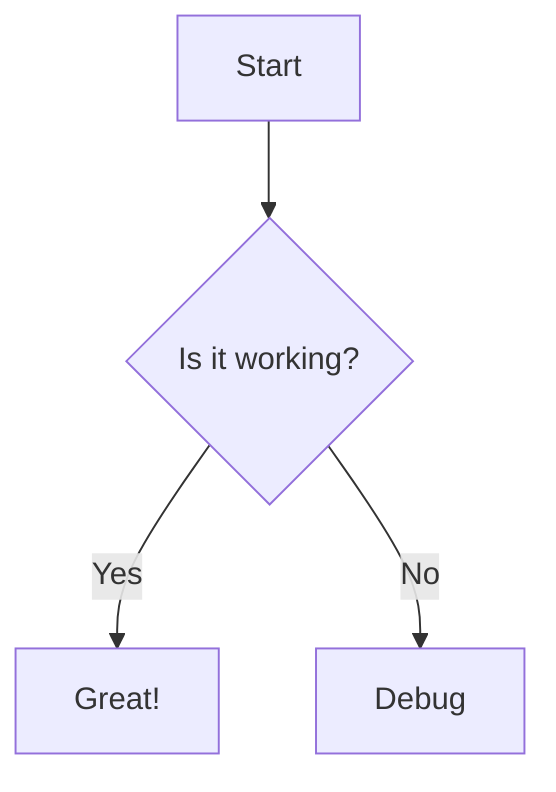

Welcome to the ultimate testing ground. This page contains every component, ensuring that layout and spacing remain robust when viewed together.

## Basic Typography

**Bold text**, *italic text*, and `inline code`. Here is a blockquote:

> This is a blockquote. It should have a nice left border and muted text.

### Tooltip & Math
Here is a <Tooltip tip="This is a tooltip!">hoverable tooltip</Tooltip>.
Einstein's famous equation is $E = mc^2$. 

$$
x = \frac{-b \pm \sqrt{b^2 - 4ac}}{2a}
$$

## Callouts & Badges

<Callout type="note" title="Note Callout">This is a note callout.</Callout>
<Callout type="warning">Warning callout without a explicit title.</Callout>
<Callout color="#10b981" icon="rocket">Custom brand color callout.</Callout>

**Badges:**
<Badge color="blue" shape="pill">Blue Pill</Badge>
<Badge color="red" stroke="true">Red Stroke</Badge>
<Badge color="green" icon="check">Success</Badge>

## Structural Components

<Accordion title="What is an accordion?">
  An accordion allows you to hide and show content.
</Accordion>

<Expandable title="Advanced Expandable Settings">
  This is a more minimal expandable section often used in API references or props.
</Expandable>

### Steps
<Steps>
  <Step title="Initialize">First you must initialize the repository.</Step>
  <Step title="Configure">Then you configure your `docs.json`.</Step>
  <Step title="Deploy">Finally, push to production!</Step>
</Steps>

### Tabs
<Tabs items={["NPM", "Yarn", "pnpm"]}>
  <Tab>
    ```bash
    npm install
    ```
  </Tab>
  <Tab>
    ```bash
    yarn install
    ```
  </Tab>
  <Tab>
    ```bash
    pnpm install
    ```
  </Tab>
</Tabs>

## Layouts (Cards and Columns)

<CardGroup cols="2">
  <Card title="Horizontal Card" icon="star" href="https://mintlify.com" horizontal="true" cta="Learn More">
    Side-by-side layout tests.
  </Card>
  <Card title="Image Card" img="https://picsum.photos/id/237/400/200">
    Standard vertical layout with image.
  </Card>
</CardGroup>

<Columns cols="3">
  <Column>Column 1</Column>
  <Column>Column 2</Column>
  <Column>Column 3</Column>
</Columns>

<Columns cols="2">
  <Tile icon="bolt" title="Fast Execution" description="Runs at the speed of light." />
  <Tile icon="shield" title="Secure" description="Encrypted end-to-end." />
</Columns>

## Media & Mermaid

<Frame caption="A framed image">
  
</Frame>



## Code & API Blocks

```javascript title="app.js" icon="file" wrap="true"
function superLongExampleThatWillWrap() {
  console.log("This is a very long string that should be wrapped because we passed wrap=true to the code block options! 0123456789");
}
```

<CodeGroup>
  <CodeBlock label="Request">
    ```bash
    curl -X POST https://api.example.com
    ```
  </CodeBlock>
  <CodeBlock label="Response">
    ```json
    { "status": "ok" }
    ```
  </CodeBlock>
</CodeGroup>

<br/>

<Panel>
  <Column>
    <h3>Create User</h3>
    <ParamField path="id" type="string" required>The user ID.</ParamField>
    <ResponseField name="status" type="string">The success status.</ResponseField>
  </Column>
  <Column>
    <RequestExample>
      ```bash Request
      curl -X POST https://api.acme.com/v1/users
      ```
    </RequestExample>
    <ResponseExample>
      ```json Response
      { "id": "123", "status": "success" }
      ```
    </ResponseExample>
  </Column>
</Panel>

## Advanced Document Types

### Tree
<Tree>
  <TreeFolder name="src" defaultOpen="true">
    <TreeFile name="index.ts" />
    <TreeFile name="App.tsx" />
  </TreeFolder>
  <TreeFile name="package.json" />
</Tree>

### Prompt
<Prompt prompt="Explain quantum computing." response="Quantum computing uses quantum bits..." />

### Color Swatches
<ColorRow>
  <ColorItem hex="#3b82f6" name="Blue 500" />
  <ColorItem hex="#10b981" name="Green 500" />
</ColorRow>

## Changelog / Update Timeline

<Update label="March 2026" description="v2.0.0" tags={["Major", "UI"]}>
  **Features**
  - Fully refactored timeline overlapping!
  - CardGroup works perfectly.
</Update>
<Update label="February 2026" description="v1.0.0">
  Initial Release!
</Update>

## Reusable Snippet & Personalization

import HelloWorld from "/snippets/hello-world.md";

<HelloWorld word="integration" />

Hello, **{user.firstName}**! Your plan is **{user.plan}**.
{ user.plan === 'Enterprise' ? <>Thank you for being an Enterprise customer!</> : <>Upgrade soon!</> }
